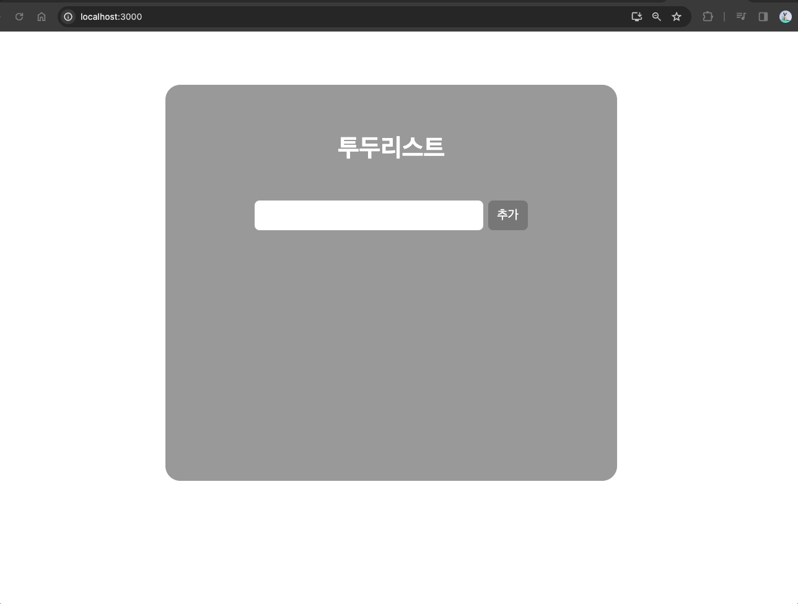

## Redux Todo

### 이 프로젝트는 React와 Redux를 사용하여 간단한 투두리스트를 구현한 예제입니다.

### 사용자는 투두리스트를 이용해 메모를 추가하고 삭제할 수 있으며 메모별 상세 페이지에 들어갈 수 있습니다.

## 기능

### 메모 추가 및 삭제: 사용자는 메모를 추가하고 삭제할 수 있습니다.

### 메모 상세: 사용자는 메모별 상세 페이지를 들어갈 수 있습니다.

## 설치 방법

#### 프로젝트 클론 후 npm install로 npm 설치

#### npm start로 로컬 실행

## 시연영상

